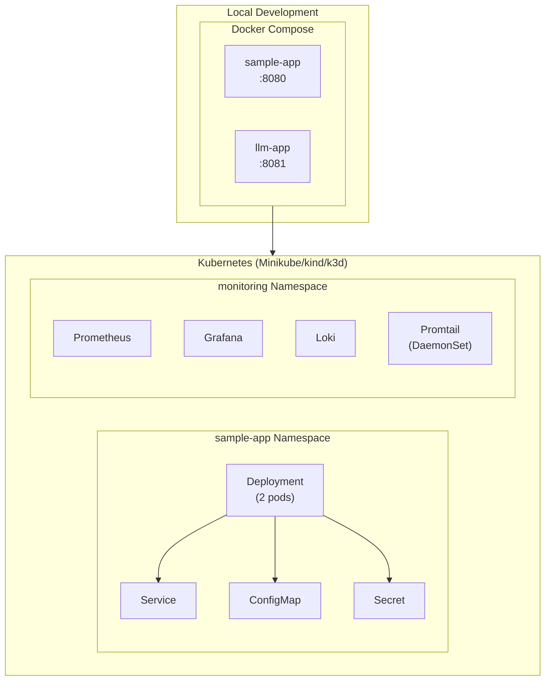
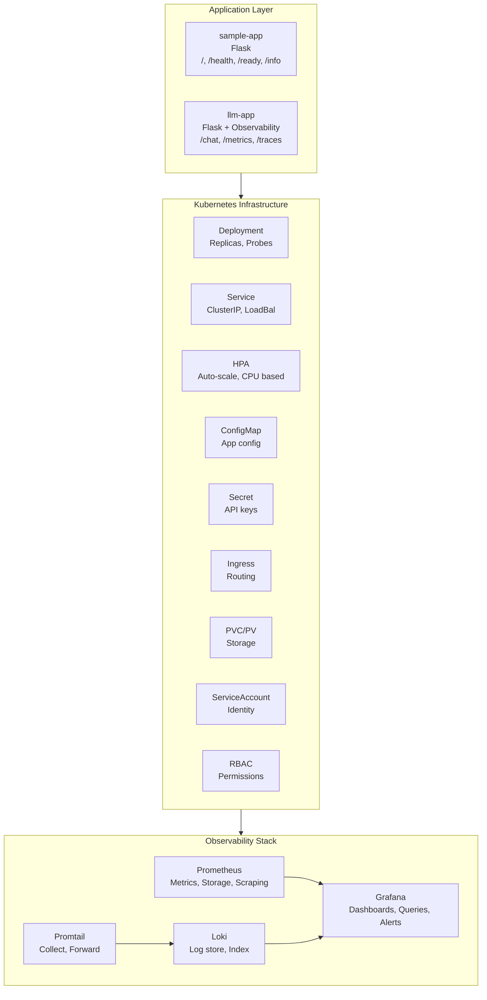
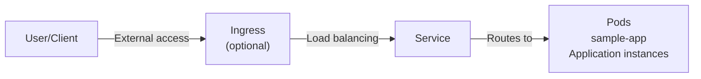
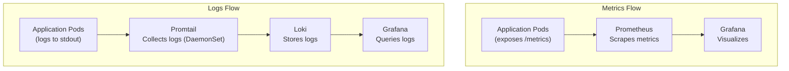
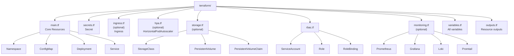
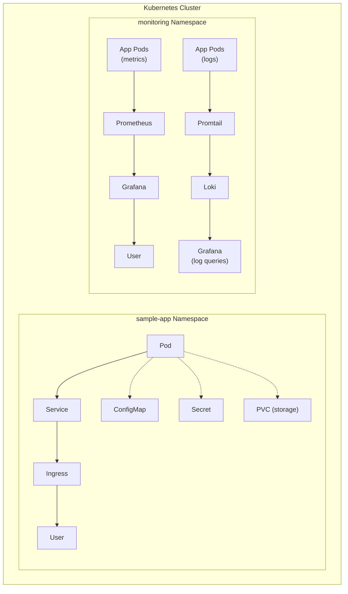
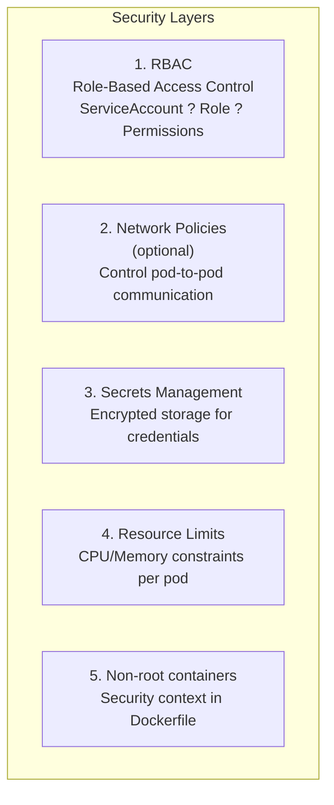
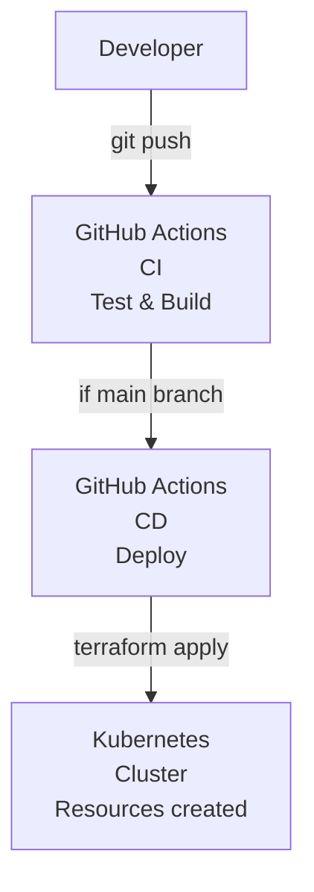
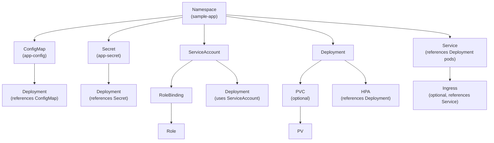

# Architecture and System Diagram

## System Overview



## Component Diagram



## Data Flow

### Request Flow



### Observability Flow



## Terraform Resource Hierarchy



## Network Architecture



## Security Layers



## Deployment Flow



## Application Code Structure

### Main Application
- **`app.py`**: Flask main application with HTTP endpoints, routes, and middleware
- **`llm_app.py`**: LLM-style application with observability features
- **`auth.py`**: Authentication module (JWT tokens, API keys, RBAC, rate limiting)
- **`migration.py`**: Database migration script for schema management

### Application Package (`app/`)

The application uses a modular package structure for better organization:

```
app/
  __init__.py      # Package initialization
  config.py        # Configuration management (env vars, validation)
  database.py      # Database connection pool and utilities
  cache.py         # Redis cache utilities
  metrics.py       # Prometheus metrics, distributed tracing, APM
```

**Benefits**:
- Clear separation of concerns
- Improved maintainability (~39% code reduction in original app.py)
- Advanced modularization: Split into `routes/` (6 files) and `auth_pkg/` (6 files)
- Flask Blueprint pattern for route organization
- Better separation of concerns for learning large-scale project structures
- Type hints for better IDE support and type safety
- Easy to extend and test
- Python package best practices

## File Structure Overview

```mermaid
graph TD
    Root["project-root/"] --> App["Application"]
    App --> AppPy["app.py<br/>Blueprint Integration<br/>(147 lines)"]
    App --> RoutesDir["routes/<br/>6 Blueprint modules"]
    App --> AuthDir["auth_pkg/<br/>6 Auth modules"]
    App --> AppPkg["app/<br/>Package modules"]
    AppPkg --> Config["config.py<br/>Configuration"]
    AppPkg --> DB["database.py<br/>DB connection"]
    AppPkg --> Cache["cache.py<br/>Redis cache"]
    AppPkg --> Metrics["metrics.py<br/>Metrics & tracing"]
    App --> LLMPy["llm_app.py<br/>LLM app with observability"]
    App --> MigPy["migration.py<br/>DB migration"]
    RoutesDir --> HealthPy["health.py<br/>Health endpoints"]
    RoutesDir --> CachePy["cache.py<br/>Cache endpoints"]
    RoutesDir --> MetricsPy["metrics.py<br/>Observability"]
    RoutesDir --> DbPy["db.py<br/>Database endpoints"]
    RoutesDir --> AuthRoutesPy["auth_routes.py<br/>Auth endpoints"]
    RoutesDir --> ProtectedPy["protected.py<br/>Protected endpoints"]
    AuthDir --> ConfigPy["config.py<br/>JWT config"]
    AuthDir --> UsersPy["users.py<br/>User management"]
    AuthDir --> JwtPy["jwt.py<br/>JWT tokens"]
    AuthDir --> ApiKeysPy["api_keys.py<br/>API keys"]
    AuthDir --> DecoratorsPy["decorators.py<br/>Decorators"]
    App --> Req["requirements.txt<br/>Dependencies"]
    
    Root --> IaC["Infrastructure as Code"]
    IaC --> MainTf["main.tf<br/>Core K8s resources"]
    IaC --> VarsTf["variables.tf<br/>Configuration variables"]
    IaC --> SecTf["secrets.tf<br/>Secret management"]
    IaC --> IngTf["ingress.tf<br/>External access"]
    IaC --> HpaTf["hpa.tf<br/>Auto-scaling"]
    IaC --> StorTf["storage.tf<br/>Persistent storage"]
    IaC --> RbacTf["rbac.tf<br/>Security"]
    IaC --> MonTf["monitoring.tf<br/>Observability stack"]
    IaC --> OutTf["outputs.tf<br/>Output values"]
    
    Root --> Config["Configuration"]
    Config --> Compose["docker-compose.yml<br/>Local development"]
    Config --> Dockerfile["Dockerfile<br/>Container image"]
    Config --> Manifests["k8s-manifests.yaml<br/>Reference manifests"]
    Config --> TfVars["terraform.tfvars.example<br/>Variable examples"]
    
    Root --> Cicd["CI/CD"]
    Cicd --> Workflows[".github/workflows/"]
    Workflows --> CiYml["ci.yml<br/>Continuous Integration"]
    Workflows --> CdYml["cd.yml<br/>Continuous Deployment"]
    
    Root --> Docs["Documentation"]
    Docs --> DocsDir["docs/"]
    DocsDir --> Arch["ARCHITECTURE.md<br/>This file"]
    DocsDir --> Practice["PRACTICE.md<br/>Exercises"]
    DocsDir --> Quick["QUICKREF.md<br/>Commands"]
    DocsDir --> Troubleshoot["TROUBLESHOOTING.md<br/>Debugging"]
    DocsDir --> Other["...<br/>Other guides"]
```



## Resource Dependencies


