# Architecture and System Diagram

## System Overview

## Component Diagram

## Data Flow

### Request Flow

### Observability Flow

## Terraform Resource Hierarchy

## Network Architecture

## Security Layers

## Deployment Flow

## File Structure Overview

```mermaid
graph TD
    Root["project-root/"] --> App["Application"]
    App --> AppPy["app.py<br/>Main Flask app"]
    App --> LLMPy["llm_app.py<br/>LLM app with observability"]
    App --> Req["requirements.txt<br/>Dependencies"]
    
    Root --> IaC["Infrastructure as Code"]
    IaC --> MainTf["main.tf<br/>Core K8s resources"]
    IaC --> VarsTf["variables.tf<br/>Configuration variables"]
    IaC --> SecTf["secrets.tf<br/>Secret management"]
    IaC --> IngTf["ingress.tf<br/>External access"]
    IaC --> HpaTf["hpa.tf<br/>Auto-scaling"]
    IaC --> StorTf["storage.tf<br/>Persistent storage"]
    IaC --> RbacTf["rbac.tf<br/>Security"]
    IaC --> MonTf["monitoring.tf<br/>Observability stack"]
    IaC --> OutTf["outputs.tf<br/>Output values"]
    
    Root --> Config["Configuration"]
    Config --> Compose["docker-compose.yml<br/>Local development"]
    Config --> Dockerfile["Dockerfile<br/>Container image"]
    Config --> Manifests["k8s-manifests.yaml<br/>Reference manifests"]
    Config --> TfVars["terraform.tfvars.example<br/>Variable examples"]
    
    Root --> Cicd["CI/CD"]
    Cicd --> Workflows[".github/workflows/"]
    Workflows --> CiYml["ci.yml<br/>Continuous Integration"]
    Workflows --> CdYml["cd.yml<br/>Continuous Deployment"]
    
    Root --> Docs["Documentation"]
    Docs --> DocsDir["docs/"]
    DocsDir --> Arch["ARCHITECTURE.md<br/>This file"]
    DocsDir --> Practice["PRACTICE.md<br/>Exercises"]
    DocsDir --> Quick["QUICKREF.md<br/>Commands"]
    DocsDir --> Troubleshoot["TROUBLESHOOTING.md<br/>Debugging"]
    DocsDir --> Other["...<br/>Other guides"]
```

## Resource Dependencies

